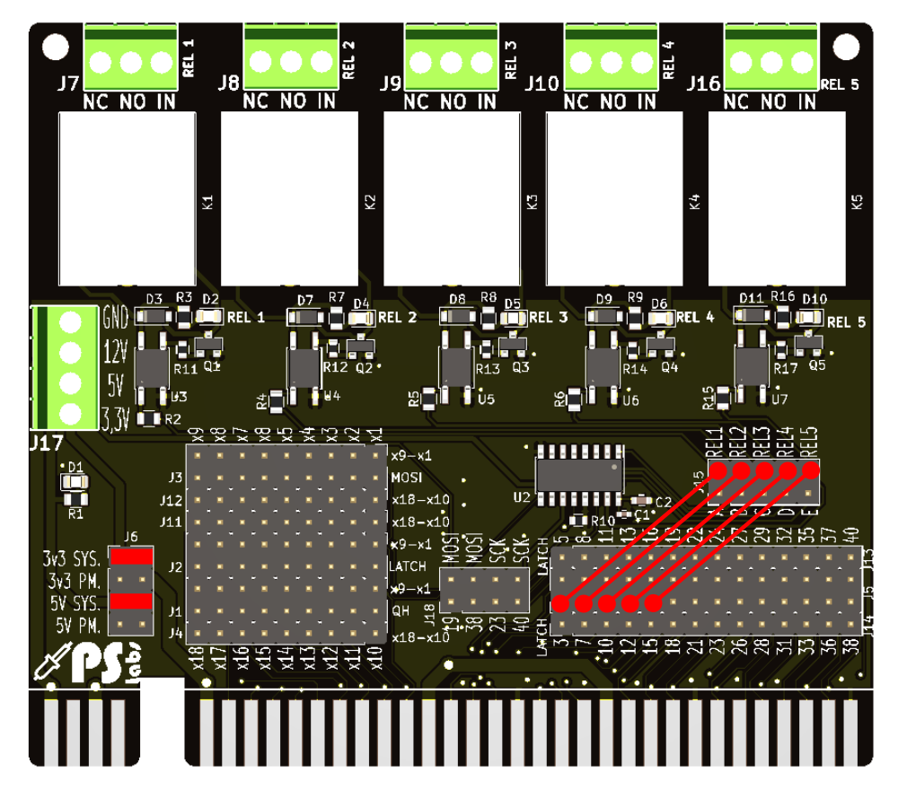

# CMM2-ExpansionCard-Relay

Schematic can be found here: [schematic REV A v02](/Schematic/relay_revA_v03.pdf)

Expansion system and cards can be purchased here: [PS Labs](https://sklep.pslabs.pl/Maximite-c91)
\
\
\

# Power source setup
Below You can find possible power source setup. Use only 2 jumpers!

# Single card setup - no SPI
In this mode maximite pins are used to activate relays. Using jumper wires connect pins with relay inputs as shown below:

Code example:

# Single card setup in SPI mode
Set up a card as shown below:

 
# Multiple card in SPI mode setup
Below You can find example of 4 card daisy chained operated by SPI interface:

 
Explanation:
 
All cards are using power taken from Maximite (red jumpers), realys are connected with A,B,C,D,E outputs of shift register card (red jumpers)
 
## CARD 1:
 1. SPI 1 is used so MOSI port is set to 19 (green jumper) and SCK port is set to 23 (yellow jumper)
 2. Pin 31 is used to latch shift register chip (blue jumper)
 3. Overflowed shift register data (QH) are send to x1 data line (pink jumper), this will be used as MOSI on next card
 
## CARD 2:
 1. Overflowed QH signal is used as MOSI now, this signal is taken from x1 data line (green jumper), SCK remains unchanged (set to pin 23 - yellow jumper)
 2. Pin 31 is used to latch shift register chip (blue jumper)
 3. Overflowed shift register data (QH) are send to x2 data line (pink jumper), this will be used as MOSI on next card
 
## CARD 3:
 1. Overflowed QH signal is used as MOSI now, this signal is taken from x2 data line (green jumper), SCK remains unchanged (set to pin 23 - yellow jumper)
 2. Pin 31 is used to latch shift register chip (blue jumper)
 3. Overflowed shift register data (QH) are send to x3 data line (pink jumper), this will be used as MOSI on next card
 
## CARD 4:
 1. Overflowed QH signal is used as MOSI now, this signal is taken from x3 data line (green jumper), SCK remains unchanged (set to pin 23 - yellow jumper)
 2. Pin 31 is used to latch shift register chip (blue jumper)
 3. Since this is last card Overflowed shift register data (QH) are not needed any longer. If You need to conect another card You cand send it for example to x4 data line
 
 Code example 1:
 
 Code Example 2:
 
 
 